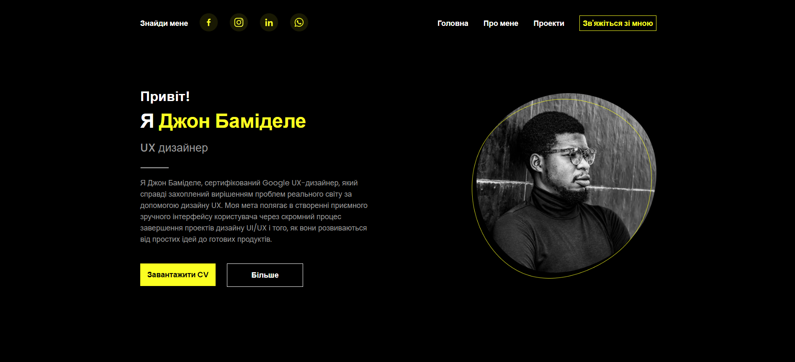
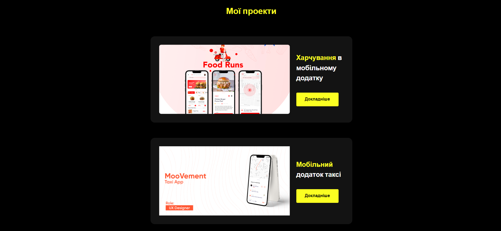
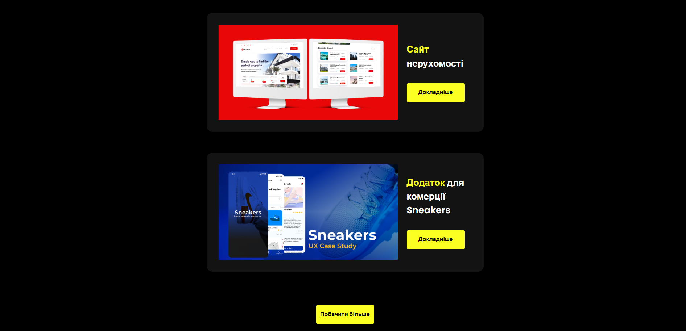
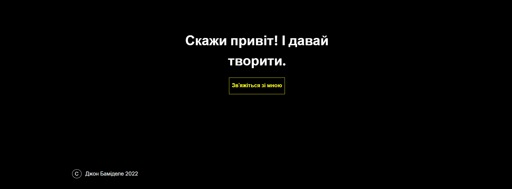
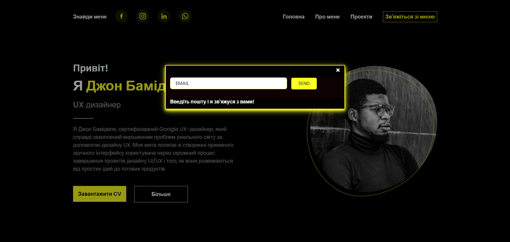

<h1 align="center"> Site Portfolio </h1>
<a href="https://toptyns.github.io/Site-Portfolio/">SITE</a>
<h2>Technologies</h2>
<ul>
  <li>HTML | 33.4%</li>
  <li>CSS | 35.1%</li>
  <li>JavaScript | 2.3%</li>
  <li>SCSS | 29.2%</li>
</ul>
<h2>Third Party Resources</h2>
<ul>
  <a href="https://atuin.ru/blog/nabor-animacij-animate-css/">animate.css</a>
</ul>
<h2>Images</h2>

